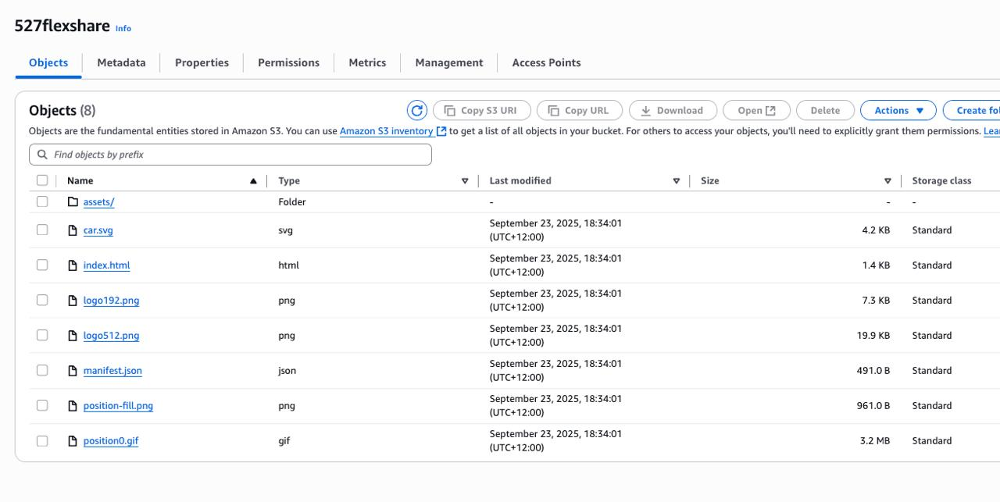

# Flexshare

## Introduction of total

FlexShare is a ride-sharing platform designed specifically for the New Zealand context, where car ownership is extremely common and vehicle occupancy is often very low. Statistics show that most trips are made with only one or two people per car, which leads to higher fuel consumption and unnecessary carbon emissions. FlexShare introduces a “third option” between public transport and taxi services: it allows everyday drivers to publish their routes and share available seats, while passengers can join and leave along the way. This improves vehicle utilization, reduces emissions, and offers a more economical travel choice.

From a technical perspective, FlexShare is built with a cloud-ready, distributed backend and a modern web front-end. The backend leverages Spring Boot 3.0 with Java 17, combining MySQL for persistent relational data and Redis for high-concurrency operations such as distributed locks, session management, and GEO-based location matching. The system follows a stateless architecture, integrated with AWS Load Balancer for scalability and reliability. CI/CD pipelines are managed with GitHub Actions, ensuring continuous validation and deployment.

Together, the system design and product vision position FlexShare as an efficient and sustainable mobility service:

For users, it provides a simple way to publish or join rides, supported by secure authentication and real-time matching.

For communities, it increases transport efficiency, lowers costs, and contributes to carbon reduction.

For operations, it is architected for growth, with modular services, robust concurrency control, and a deployment pipeline fit for production.

## Driver End Demo Video(Youtube)

[](https://www.youtube.com/shorts/QHrtSEZEEe8)

## Passenger End Demo Video(Youtube)

[](https://www.youtube.com/shorts/aGSRnuGI79M)

# FlexShare Backend

## Introduction of backend server

This project is a **Spring Boot 3.0** application developed as the backend server for the FlexShare system.

FlexShare is designed as a "private bus" service that provides a reliable, safe, and efficient way for users to share transport routes, with a distributed, cloud-ready backend that supports scalability and high availability.

## Framework Diagram


### Goals

The backend server is designed with the following overall goals:
**Provide secure user management**, including registration, login, and authentication.
**Handle schedules and routes** with high reliability and concurrency control.
**Ensure a distributed, non-state (stateless) architecture** so the system can scale easily in a cloud environment.
**Support transaction management** and data storage using both SQL (**MySQL**) and NoSQL (**Redis**) databases.
**Prepare for future payment and billing features** (not yet implemented).
\*\*Centralized Configuration Based on Cloud Services.

### Architecture Highlights

The design employs a **stateless architecture** for service distribution. We combine **MySQL** for relational data (e.g., user profiles, schedules) and **Redis** for fast, high-concurrency operations.

To improve **concurrency** and **reliability**:

-   A **distributed session mechanism** is built with Redis to allow **Single Sign-On (SSO)**.
-   A **distributed lock** is implemented using Redis to prevent data conflicts when multiple users update schedules simultaneously.
-   A **GEO data structure** is utilized for quickly matching route points with user locations.
-   The system is integrated with an **AWS Load Balancer** via a health check API.
-   **GitHub Actions** are used for Continuous Integration and Deployment (CI/CD).

---

## Technologies Used

| Category             | Technology        | Version | Purpose                                                  |
| :------------------- | :---------------- | :------ | :------------------------------------------------------- |
| **Backend**          | Java              | 17      | Core programming language                                |
| **Framework**        | Spring Boot       | 3.0     | Application framework                                    |
| **Build**            | Maven             | 3.8+    | Dependency management and build automation               |
| **Database (SQL)**   | MySQL             | 8.0+    | Persistent storage for relational data                   |
| **Database (NoSQL)** | Redis             | 6.0+    | Caching, session management, distributed locks, GEO data |
| **Deployment**       | AWS Load Balancer | -       | Health check integration                                 |
| **CI/CD**            | GitHub Actions    | -       | Automated build and testing                              |

---

## Features

### 1. User Module

-   **User Creation:** Built with MyBatis Plus and MySQL. Registration includes **email verification** for security.
-   **User Authorization & Login:** Features a robust, distributed session design based on Redis key-value storage, supporting **Single Sign-On (SSO)**.
-   **Security:** User data (passwords) is secured with **salted encryption**.

### 2. Schedule Module

-   **Concurrency Control:** Uses a **distributed lock** (Redis-based) to prevent race conditions during schedule creation, subscription, and update.
-   **Geo-based Scheduling:** Implemented with Redis's efficient **GEO data structure** for splitting and quickly matching route points by location.

### 3. System & Security

-   **Health Check:** Integrated API endpoint for **AWS Load Balancer** health checks.
-   **CORS Filter:** Implemented a Cross-Origin Resource Sharing filter to protect APIs.
-   **Authentication:** Email login with verification ensures safe access.

---

## Project Structure

```

flexshare-backend/
├── pom.xml
├── src/
│   ├── main/
│   │   ├── java/com/jl/flexshare/
│   │   │   ├── FlexShareApplication.java
│   │   │   ├── config/        \# App configuration (CORS, Redis, Security)
│   │   │   ├── controller/    \# REST controllers
│   │   │   ├── entity/        \# Data models (MySQL/Redis)
│   │   │   ├── exception/     \# Custom exception handling
│   │   │   ├── filter/        \# Security filters (e.g., Auth, CORS)
│   │   │   ├── listener/      \# Redis key expiration listeners (for sessions)
│   │   │   ├── lock/          \# Distributed lock implementation with Redis
│   │   │   ├── mapper/        \# MyBatis mappers for MySQL interaction
│   │   │   ├── result/        \# Standardized result wrapper for API responses
│   │   │   ├── service/       \# Business service interfaces
│   │   │   ├── imply/         \# Service implementations
│   │   │   ├── utils/         \# General utility functions
│   │   │   └── validation/    \# Request validation groups
│   │   └── resources/
│   │       ├── application.yml  \# Spring Boot configuration
│   │       └── mysql.sql        \# Initial database schema and data
│   └── test/java/com/flexshare/
│       └── MemberTest.java      \# Unit/Integration tests
└── target/ (build output)

```

---

## Setup Instructions

### Prerequisites

You must have the following installed and running:

-   **Java 17+**
-   **Maven 3.8+**
-   **MySQL 8.0+**
-   **Redis 6.0+**

### Steps

1.  **Clone the repository:**

    ```bash
    git clone https://github.com/Flexshare2025/Flexshare (change to your github acc firstly)
    cd Flex Share Server
    ```

2.  **Database Setup:**

    -   Start your MySQL and Redis servers.
    -   Update the `src/main/resources/application.yml` file with your database connection details (MySQL and Redis).
    -   Initialize your MySQL database using the schema in `src/main/resources/mysql.sql`.

3.  **Run the Application:**

    **Option A: Run directly with Maven**

    ```bash
    mvn spring-boot:run
    ```

    **Option B: Build and run the JAR file**

    ```bash
    mvn clean package
    java -jar target/member-service-1.0-SNAPSHOT.jar
    ```

---

## CI/CD with GitHub Actions

This project uses **GitHub Actions** for automated deployment.

A workflow is configured to run automatically on every push to the repository. This workflow builds the project, runs tests, and ensures the code is always validated before deployment.

---

# Flex Share (Ride-sharing platform) - Front-end

You can access it via the link: <https://9whrslv2k8.execute-api.us-east-1.amazonaws.com/flexshare/app/index.html>, or scan the QR code with your mobile phone. 

This document is a quick get-up-and-run description of a front-end (web) project
For more complete information check out：[Project-Overview.md](./Project-Overview.md).

## 1、Environmental requirements

-   Node.js >= 18（recommend LTS）
-   npm >= 9 or pnpm/yarn
-   Google Maps API Key（Enable Maps JavaScript API、Places API、Directions API）

## 2、Directory structure (front end)

```
web/
  src/
    api/
      index.js                # front end interface
    assets/                   # Static Image Resources
    components/               # General Components
      Header/
      Loading/
      Nav/
      ProtectedRoute/
      search-location.jsx
      search-locationv1.jsx
    pages/                    # pages
      Passenger/              # passenger
        component/
          ControlPanel.jsx
          DirectionsProvider.jsx
          MapView.jsx
          OrderList.jsx
          PassengerOrderList.jsx
        index.jsx
        index.scss
      Driver/                 # driver
        PublishRoute/
        Rode/
        index.jsx
        index.scss
      Login/
      Register/
      ForgotPassword/
      NotFound/
    utils/                    # Tools (request, storage, positioning, etc.)
    App.jsx                   # root component
    main.jsx                  # main
    index.css                 # Global Style
    constant.js               # constant
  public/
    manifest.json
  dist/                       # Production of build
  package.json
  vite.config.js
  eslint.config.js
  README.md
```

## 3、Front-end (web) start

1. Enter the directory

```bash
cd web
```

2. Installation of dependencies

```bash
npm install
```

3. Configuring Environment Variables

    in `web/.env.local` New and Configured：

```bash
VITE_GOOGLE_MAPS_API_KEY= GoogleMapsAPIKey
```

4. Run locally

```bash
npm run dev
```

5. Production build

```bash
npm run build
```

Build products in `web/dist/`.

## 4、Brief description of key functions (front-end)

-   Passenger Page
    -   Use Google Maps to display your current location and route planner
    -   Support start and end point selection, matching driver's trip list, placing orders
-   Driver Page
    -   Posting routes, managing orders and seating capacity
    -   Login/Register/Retrieve Password: Basic Authentication Process and Protected Routing

## 5、Development contract

-   Code style: follows the ESLint/Prettier configuration within the project
-   Component naming: Big Hump, Folders & Entries `index.jsx`/`index.scss`
-   State management: with the component's internal `useState/useEffect`
-   API calls: unified under `web/src/api/`.

## 6、Automated deployment

-   Use Github Actions to deploy web to AWS S3.

```yml
name: Deploy web to AWS S3

on:
    push:
        branches: [main]

jobs:
    deploy:
        runs-on: ubuntu-latest

        steps:
            - name: Checkout code
              uses: actions/checkout@v4

            - name: Setup Node.js
              uses: actions/setup-node@v4
              with:
                  node-version: '20'
                  cache: 'npm'
                  cache-dependency-path: './web/package-lock.json'

            - name: Install dependencies and build
              working-directory: ./web
              run: |
                  npm ci
                  npm run build

            - name: Check AWS Region configuration
              run: |
                  if [ -z "${{ secrets.AWS_REGION }}" ]; then
                    echo "Error: AWS_REGION secret is not set"
                    exit 1
                  fi

            - name: Configure AWS credentials
              uses: aws-actions/configure-aws-credentials@v4
              with:
                  aws-access-key-id: ${{ secrets.AWS_ACCESS_KEY_ID }}
                  aws-secret-access-key: ${{ secrets.AWS_SECRET_ACCESS_KEY }}
                  aws-region: ${{ secrets.AWS_REGION }}

            - name: Deploy web to S3
              run: |
                  aws s3 sync ./web/dist s3://${{ secrets.AWS_S3_BUCKET }} --delete
```

Then you can see the files in S3 bucket.



## 7. Documentation

-   Front-end Project Overview and Technical Guide：[Project-Overview.md](./web/Project-Overview.md)

## 8. Frequently Asked Questions

-   The map is not displayed/blank:
    -   check `VITE_GOOGLE_MAPS_API_KEY`
    -   Confirm that the relevant Google Maps APIs are enabled
    -   Whether or not browser location permissions are allowed

## 9. Resources

1. IconFont：<https://www.iconfont.cn/>
2. React Hooks（ahooks/use-request）：<https://ahooks.js.org/hooks/use-request/index>
3. Ant Design Mobile components：<https://ant-design-mobile.antgroup.com/components/button>
4. Google Maps React ：<https://developers.google.com/codelabs/maps-platform/maps-platform-101-react-js>
