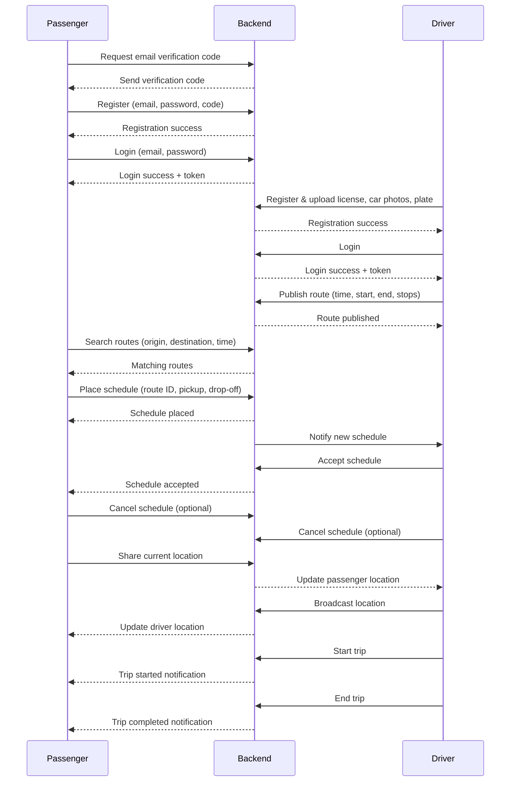

# **FlexShare App**

- [**FlexShare App**](#flexshare-app)
  - [**API**](#api)
    - [**1. Authentication Module**](#1-authentication-module)
      - [1.1 Get Email Verification Code](#11-get-email-verification-code)
      - [1.2 User Registration](#12-user-registration)
      - [1.3 Email Verification (Link)](#13-email-verification-link)
      - [1.4 User Login](#14-user-login)
      - [1.5 Get Current User Info](#15-get-current-user-info)
    - [**2. Driver Module**](#2-driver-module)
      - [2.1 Upload License \& Vehicle Info](#21-upload-license--vehicle-info)
      - [2.2 Publish a Route](#22-publish-a-route)
      - [2.3 Accept an Schedule](#23-accept-an-schedule)
      - [2.4 Cancel an Schedule](#24-cancel-an-schedule)
      - [2.5 Broadcast Driver Location (Real-Time Tracking)](#25-broadcast-driver-location-real-time-tracking)
      - [2.6 Start a Trip](#26-start-a-trip)
      - [2.7 End a Trip](#27-end-a-trip)
    - [**3. Passenger Module**](#3-passenger-module)
      - [3.1 Search for Routes](#31-search-for-routes)
      - [3.2 Place an Schedule](#32-place-an-schedule)
      - [3.3 Cancel an Schedule](#33-cancel-an-schedule)
      - [3.4 Update Passenger Location (Real-Time)](#34-update-passenger-location-real-time)
    - [**4. Schedules Module (Shared)**](#4-schedules-module-shared)
      - [4.1 Get Schedule Details](#41-get-schedule-details)
      - [4.2 Get Schedules List](#42-get-schedules-list)

PRD: [FlexShare App](https://modao.cc/proto/yJ6LW3nWszjbp418O0lLPs/sharing?view_mode=read_only&screen=rbpUrC76wnj9YxW30)

## **API**



### **1. Authentication Module**

#### 1.1 Get Email Verification Code

**POST** `/api/auth/send-verification-code`  

**Request Body**:

```json
{
  "email": "user@example.com"
}
```

**Response**:

```json
{
  "status": "success",
  "message": "Verification code sent to your email"
}
```

---

#### 1.2 User Registration

**POST** `/api/auth/register`  

**Request Body**:

```json
{
  "email": "user@example.com",
  "password": "string",
  "name": "string",
  "role": "passenger" | "driver",
  "verification_code": "123456"
}
```

**Response**:

```json
{
  "status": "success",
  "message": "Registration successful"
}
```

---

#### 1.3 Email Verification (Link)

**GET** `/api/auth/verify-email?token=xxxx`  

**Query Parameters**:

* `token` – verification token from email link

**Response**:

```json
{
  "status": "success",
  "message": "Email verified successfully"
}
```

---

#### 1.4 User Login

**POST** `/api/auth/login`  

**Request Body**:

```json
{
  "email": "user@example.com",
  "password": "string"
}
```

**Response**:

```json
{
  "status": "success",
  "token": "jwt_token_string",
  "user": {
    "id": "string",
    "name": "string",
    "role": "passenger" | "driver",
    "email": "string"
  }
}
```

---

#### 1.5 Get Current User Info

**GET** `/api/auth/me`  

**Headers**:

* `Authorization: Bearer jwt_token`

**Response**:

```json
{
  "id": "string",
  "name": "string",
  "role": "passenger" | "driver",
  "email": "string"
}
```

---

### **2. Driver Module**

#### 2.1 Upload License & Vehicle Info

**POST** `/api/driver/upload-docs`  

**Form Data**:

```
driver_license_image: file
vehicle_photo: file
plate_number: string
vehicle_model: string
```

**Response**:

```json
{
  "status": "success",
  "message": "Documents uploaded successfully"
}
```

---

#### 2.2 Publish a Route

**POST** `/api/driver/routes`  

**Request Body**:

```json
{
  "start_point": { "lat": 123.45, "lng": 67.89, "address": "string" },
  "end_point": { "lat": 124.00, "lng": 68.00, "address": "string" },
  "stops": [
    { "lat": 123.50, "lng": 67.90, "address": "string" }
  ],
  "departure_time": "2025-08-12T09:00:00Z",
  "available_seats": 4,
  "price_per_km": 2.5
}
```

**Response**:

```json
{
  "status": "success",
  "route_id": "string"
}
```

---

#### 2.3 Accept an Schedule

**POST** `/api/driver/schedules/{schedule_id}/accept`  

**Response**:

```json
{
  "status": "success",
  "message": "Schedule accepted"
}
```

---

#### 2.4 Cancel an Schedule

**POST** `/api/driver/schedules/{schedule_id}/cancel`  

**Request Body**:

```json
{
  "reason": "string"
}
```

**Response**:

```json
{
  "status": "success",
  "message": "Schedule cancelled"
}
```

---

#### 2.5 Broadcast Driver Location (Real-Time Tracking)

**POST** `/api/driver/location`  

**Headers**:

* `Authorization: Bearer jwt_token` (driver)

**Request Body**:

```json
{
  "lat": 123.45,
  "lng": 67.89,
}
```

**Response**:

```json
{
  "status": "success",
  "message": "Location updated"
}
```

---

#### 2.6 Start a Trip

**POST** `/api/driver/trips/{trip_id}/start`  

**Response**:

```json
{
  "status": "success",
  "message": "Trip started"
}
```

---

#### 2.7 End a Trip

**POST** `/api/driver/trips/{trip_id}/end`  

**Response**:

```json
{
  "status": "success",
  "message": "Trip completed"
}
```

---

### **3. Passenger Module**

#### 3.1 Search for Routes

**GET** `/api/passenger/routes/search`  

**Query Parameters**:

* `start_lat`
* `start_lng`
* `end_lat`
* `end_lng`
* `departure_date`

**Response**:

```json
[
  {
    "route_id": "string",
    "driver": { "id": "string", "name": "string", "rating": 4.8 },
    "start_point": { "lat": 123.45, "lng": 67.89, "address": "string" },
    "end_point": { "lat": 124.00, "lng": 68.00, "address": "string" },
    "stops": [],
    "departure_time": "2025-08-12T09:00:00Z",
    "available_seats": 3,
    "price_estimate": 15.0
  }
]
```

---

#### 3.2 Place an Schedule

**POST** `/api/passenger/schedules`  

**Request Body**:

```json
{
  "route_id": "string",
  "pickup_point": { "lat": 123.46, "lng": 67.91, "address": "string" },
  "dropoff_point": { "lat": 123.99, "lng": 68.01, "address": "string" },
  "seat_count": 1
}
```

**Response**:

```json
{
  "status": "success",
  "schedule_id": "string"
}
```

---

#### 3.3 Cancel an Schedule

**POST** `/api/passenger/schedules/{schedule_id}/cancel`  

**Request Body**:

```json
{
  "reason": "string"
}
```

**Response**:

```json
{
  "status": "success",
  "message": "Schedule cancelled"
}
```

---

#### 3.4 Update Passenger Location (Real-Time)

**POST** `/api/passenger/location`  

**Headers**:

* `Authorization: Bearer jwt_token` (passenger)

**Request Body**:

```json
{
  "lat": 123.50,
  "lng": 67.95
}
```

**Response**:

```json
{
  "status": "success",
  "message": "Passenger location updated"
}
```

---

### **4. Schedules Module (Shared)**

#### 4.1 Get Schedule Details

**GET** `/api/schedules/{schedule_id}`  

**Response**:

```json
{
  "schedule_id": "string",
  "route_id": "string",
  "status": "pending" | "accepted" | "cancelled" | "completed",
  "driver": { "id": "string", "name": "string" },
  "passenger": { "id": "string", "name": "string" },
  "pickup_point": { "lat": 123.46, "lng": 67.91, "address": "string" },
  "dropoff_point": { "lat": 123.99, "lng": 68.01, "address": "string" },
  "price": 20.0,
  "created_at": "2025-08-11T10:00:00Z"
}
```

---

#### 4.2 Get Schedules List

**GET** `/api/schedules`  

**Query Parameters**:

* `role=passenger|driver`
* `status=pending|accepted|completed|cancelled`

**Response**:

```json
[
  {
    "schedule_id": "string",
    "status": "pending",
    "pickup_point": { "lat": 123.46, "lng": 67.91, "address": "string" },
    "dropoff_point": { "lat": 123.99, "lng": 68.01, "address": "string" },
    "price": 20.0
  }
]
```
