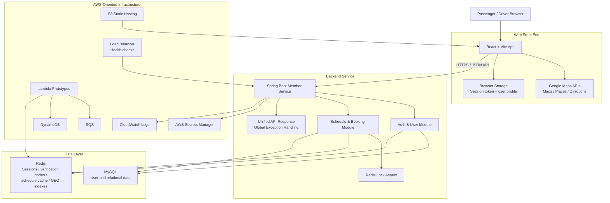
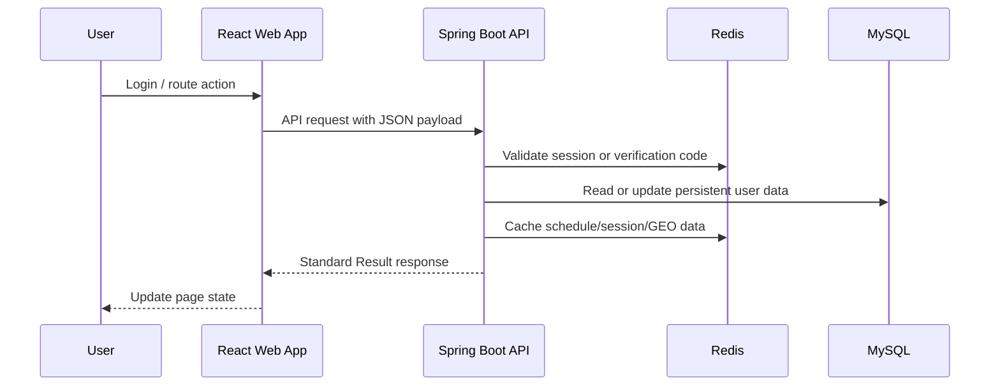
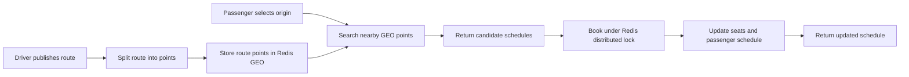

# Architecture

FlexShare is a route-sharing platform with a React front end, a Spring Boot backend, Redis for fast coordination, and MySQL for relational persistence.

## High-Level Components

## Request Flow

## Schedule Matching Flow

## Front End

The front end lives in `web/` and is built with React, Vite, SCSS, and Google Maps APIs.

Primary responsibilities:

- Passenger route search and booking UI.
- Driver route publishing and schedule management UI.
- Login, registration, password reset, and protected routing.
- Google Maps route display, location search, and directions rendering.

## Backend

The backend lives in `backend/member-service/`.

Primary responsibilities:

- User registration, login, password reset, and email verification.
- Session management and single-login enforcement through Redis.
- Driver schedule creation, route indexing, matching, booking, and cancellation.
- Redis-backed distributed locking for high-contention schedule updates.
- Standardized API response wrappers and global exception handling.

## Data Stores

| Store | Usage |
| --- | --- |
| MySQL | User profile and relational persistence |
| Redis | Session tokens, verification codes, schedule cache, distributed locks, GEO indexes |

## Core Flows

### Authentication

1. User requests email verification.
2. Verification code is cached in Redis with a short TTL.
3. User registers or resets password using the code.
4. Login validates credentials and stores the active session in Redis.
5. API requests pass the session token through the `Authorization` header.

### Driver Schedule Publishing

1. Driver submits route, departure time, seats, price, and route points.
2. Backend validates departure timing.
3. Schedule is stored globally in Redis.
4. Route points are indexed in Redis GEO for passenger matching.
5. Timeout keys are created to update stale schedules.

### Passenger Matching and Booking

1. Passenger selects a start and destination point.
2. Backend searches nearby route points using Redis GEO.
3. Pending schedules with available seats are returned.
4. Booking runs under a Redis lock to prevent seat oversubscription.
5. Driver schedule is updated and optional notifications are sent.

## Security Posture

The codebase includes:

- BCrypt password hashing.
- Redis-backed session validation.
- Centralized exception handling.
- Security headers.
- Validation groups for user and schedule requests.
- IAM and MFA documentation in `security/`.

See `SECURITY.md` and `security/README.md` for more details.
