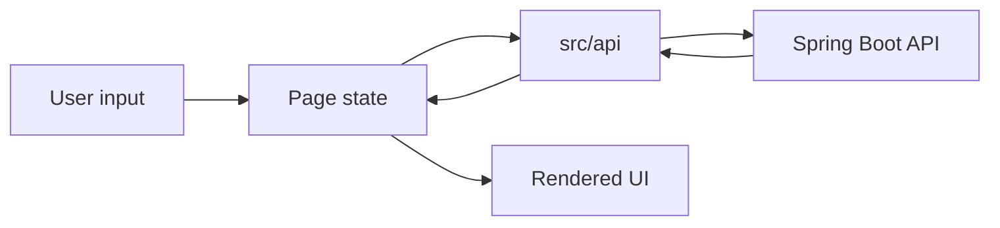
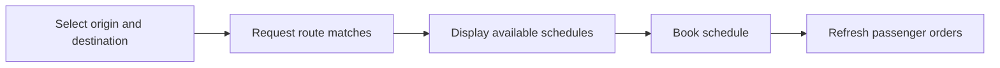
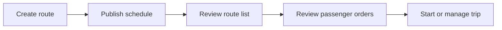

# FlexShare Web Project Overview

This document describes the front-end architecture and user flows for the FlexShare web application.

## Goals

- Provide a mobile-first interface for passenger and driver workflows.
- Integrate Google Maps for location selection, route display, and directions.
- Keep authentication and protected routing simple and predictable.
- Centralize API access and local storage utilities.

## Application Areas

### Passenger

Passenger pages support:

- Current location detection.
- Origin and destination selection.
- Route matching against available driver schedules.
- Booking a schedule.
- Viewing existing passenger orders.

Key files:

- `src/pages/Passenger/index.jsx`
- `src/pages/Passenger/component/ControlPanel.jsx`
- `src/pages/Passenger/component/MapView.jsx`
- `src/pages/Passenger/component/OrderList.jsx`
- `src/pages/Passenger/component/PassengerOrderList.jsx`
- `src/pages/Passenger/component/DirectionsProvider.jsx`

### Driver

Driver pages support:

- Route publishing.
- Seat and price configuration.
- Published route review.
- Passenger order review.
- In-trip status views.

Key files:

- `src/pages/Driver/index.jsx`
- `src/pages/Driver/PublishRoute/index.jsx`
- `src/pages/Driver/PublishRoute/components/RouteList/index.jsx`
- `src/pages/Driver/PublishRoute/components/UserOrderList/index.jsx`
- `src/pages/Driver/Rode/index.jsx`

### Authentication

Authentication pages support:

- Login.
- Registration.
- Password recovery.
- Protected-route checks.

Key files:

- `src/pages/Login/index.jsx`
- `src/pages/Register/index.jsx`
- `src/pages/ForgotPassword/index.jsx`
- `src/components/ProtectedRoute/index.jsx`
- `src/utils/storage.js`

## Data Flow



## Passenger Flow



## Driver Flow



## Conventions

- Keep page-specific logic inside `src/pages/`.
- Keep reusable UI under `src/components/`.
- Keep storage, geolocation, and small helper logic under `src/utils/`.
- Route API calls through `src/api/index.js`.
- Keep secrets and API keys in `.env.local`.

## Build and Deployment

```bash
cd web
npm install
npm run build
```

The build output is `web/dist/`. The original deployment target was AWS S3, but workflow automation is currently disabled in this repository.
