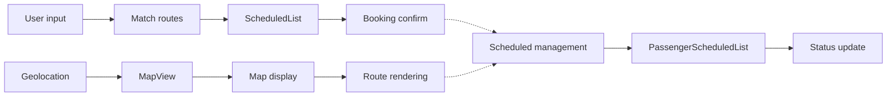
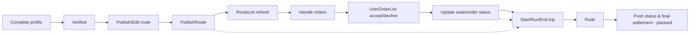

## Flex Share Front-end Overview & Technical Guide

This document consolidates the front-end project overview and technical guide. It covers:

-   Project introduction
-   Tech stack
-   Architecture & directory structure
-   Sign-up & sign-in flow
-   Core business flows
-   Development workflow & conventions
-   APIs & data flow
-   Deployment & run
-   API conventions

### 1. Project Goals

-   Provide an easy ride-sharing service connecting passengers and drivers
-   Support route publishing, route matching, booking/accepting orders, seat management, order list, notifications
-   Mobile-first web experience

### 2. Tech Stack

-   Build tool: Vite
-   Framework: React 18 (function components, Hooks)
-   UI/Components: Ant Design Mobile (on demand)
-   Maps: @vis.gl/react-google-maps (Google Maps JS API wrapper)
-   Language & styles: JavaScript (ESNext) / JSX / SCSS
-   Quality: ESLint

### 3. Front-end Architecture Overview

-   Front-end: `web/` (Vite + React)
    -   Google Maps integrations (Maps/Places/Directions)
    -   Passenger and Driver core flows

See architecture sketches: `Proposal/Project_Architecture.png` and `ProjectArchitecture.drawio`

### 4. Directory Structure (Front-end)

```
web/
  src/
    api/
      index.js                # API wrapper
    assets/                   # Static images
    components/               # Shared components
      Header/
      Loading/
      Nav/
      ProtectedRoute/
      search-location.jsx
      search-locationv1.jsx
    pages/                    # Pages
      Passenger/              # Passenger
        component/
          ControlPanel.jsx
          DirectionsProvider.jsx
          MapView.jsx
          OrderList.jsx
          PassengerOrderList.jsx
        index.jsx
        index.scss
      Driver/                 # Driver
        PublishRoute/
        Rode/
        index.jsx
        index.scss
      Login/
      Register/
      ForgotPassword/
      NotFound/
    utils/                    # Utilities (request, storage, geolocation, etc.)
    App.jsx                   # Root component
    main.jsx                  # Entry
    index.css                 # Global styles
    constant.js               # Constants
  public/                     # Static assets & PWA files
    manifest.json
  dist/                       # Production build output
  package.json
  vite.config.js
  eslint.config.js
  README.md

```

### 5. Sign-up & Sign-in Flow

-   Involved files

    -   `web/src/pages/Register/index.jsx`: registration form, validation and submit
    -   `web/src/pages/Login/index.jsx`: login form, validation and submit
    -   `web/src/components/ProtectedRoute/index.jsx`: protected route guard & redirect
    -   `web/src/utils/storage.js`: local storage (token, user)
    -   `web/src/api/index.js`: API wrapper

-   Sign-in flow

    1. User enters account/password → validate inputs
    2. Submit login (POST `/api/users/login` example)
    3. On success: `storage.setToken(token)`, `storage.setUser(user)` → redirect to protected page
    4. On failure: show error (invalid account or password)

-   Sign-up flow

    1. User enters email/phone, password, confirm password → validate
    2. Submit register (POST `/api/users/register` example)
    3. On success: show success → navigate to login
    4. On failure: show error (account exists, invalid verification, etc.)

-   Protected routes (auth guard)

    -   Before entering restricted pages, check `storage.getToken()`
    -   No token → redirect to `/login`
    -   Has token → render children

-   Logout & token expiration

    -   Logout: clear `storage.removeToken()` and `storage.removeUser()` → redirect `/login`
    -   Expired: on 401, prompt re-login (or refresh token if backend supports)

### 6. Core Business Flows

-- Passenger:

        1. Allow geolocation → resolve current position → select origin/destination
        2. Call backend matching API to get driver schedules
        3. Review available seats and place order; on success, decrease available seats in UI
        4. View order list in a popup
        -   Design
        -   Component hierarchy
            Passenger/index.jsx (controller)
            ├── MapView.jsx (map)
            ├── ControlPanel.jsx (inputs)
            ├── OrderList.jsx (matched routes)
            ├── PassengerOrderList.jsx (my orders)
            └── DirectionsProvider.jsx (directions service)
            └── Provides route calculation for MapView and OrderList
        -   Data flow



-- Driver:

    1. Publish route and time, set seats
    2. Review passenger orders, accept/decline
    3. Update trip status during execution (settlement planned)
        -   Design
        -   Component hierarchy
          Driver/index.jsx (controller)
          ├── PublishRoute/index.jsx (publish & manage routes)
          │ ├── components/RouteList/index.jsx (my routes)
          │ └── components/UserOrderList/index.jsx (passenger orders)
          └── Rode/index.jsx (in-trip page: start/end/status)
        -   Data flow



### 7. Development Workflow & Conventions

-   Environment: Node ≥ 18; set `VITE_GOOGLE_MAPS_API_KEY` in `web/.env.local`
-   Local dev: `cd web && npm install && npm run dev`
-   Coding conventions:
    -   Pass ESLint; Naming: PascalCase for components/dirs, camelCase for functions/vars
    -   Structure: page and style use paired `index.jsx` / `index.scss`
    -   API requests go through `src/api/`

### 8. APIs & Data Flow

-   API wrapper: use `src/api/index.js` for base path and HTTP methods
-   Passenger flow:
    1. `ControlPanel` collects origin/destination/passengers → call match API
    2. Feed result list into `OrderList`
    3. After booking success, update available seats inline via `onUpdateSchedule`
-   Driver flow:
    1. `PublishRoute` publishes/edits routes → `RouteList` refresh
    2. `UserOrderList` accepts/declines orders → update order status and seats
    3. `Rode` updates trip status (start/end)
-   State & storage: local `useState/useEffect` + props; `utils/storage.js` for token/user
-   Response shape: `{ code, message, data }`

### 9. Deployment & Run

-   Build: `cd web && npm run build` (outputs to `web/dist`)
-   Deploy: host `dist/` on static servers, use github actions to upload dist file to AWS S3.
-   Notes: bind domain to Google Maps API Key; enable HTTPS and proper caching

### 10. API Conventions

-   Auth: obtain token after login, persist via `web/src/utils/storage.js`
-   Errors: unified shape `{ code, message, data }`; branch by `code`
